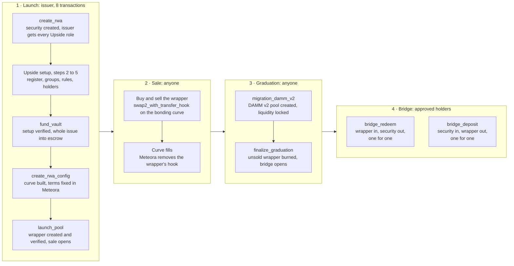

# Aegis Protocol

Aegis is a launchpad for real-world assets on Solana. An issuer locks a regulated security in an on-chain escrow, sells a wrapper token backed one for one by that escrow on a [Meteora Dynamic Bonding Curve](https://github.com/MeteoraAg/dynamic-bonding-curve), and when the sale fills the wrapper graduates into a permanent [Meteora DAMM v2](https://github.com/MeteoraAg/damm-v2) pool. After graduation, approved holders can convert between the wrapper and the security one for one through the Aegis bridge.

The security never leaves its compliance rules, which are enforced by [Upside](https://github.com/upsideos/upsideos-solana-rwa)'s Access Control and Transfer Restrictions programs. The wrapper trades freely. The escrow keeps the two equal, and once the wrapper exists the program re-checks that on every instruction that moves either token.

> **Status:** live on Solana devnet.

Aegis is a submission to the [Colosseum Crypto World's Fair](https://colosseum.com/worldsfair) hackathon (September 14 to October 12, 2026): [project page](https://colosseum.com/arena/projects/aegis-protocol-4). It is also built for Meteora's side track, [Best use of Meteora's Dynamic Bonding Curve](https://superteam.fun/earn/listing/meteora-dbc), on Superteam Earn. Follow the project on X at [@aegis_rwa](https://x.com/aegis_rwa).

## Motivation

A tokenized building, bond or fund share is still a security: only holders the issuer has approved may own it, so it cannot trade on an open market. Tokenized assets today either sit in approved wallets with no market and no price discovery, or trade freely with nothing on chain proving what backs them.

Aegis separates the two jobs. Identity checks apply where the law needs them, when someone takes ownership of the security. Price discovery and trading happen on an open market in a wrapper whose backing anyone can verify.

## How it works



An issuer sends eight transactions. Steps 2 to 5 go straight to Upside: Aegis does not configure compliance for the issuer, it verifies it before locking the asset. After graduation the wrapper also trades freely on the DAMM v2 pool. Detailed diagrams of every flow, account and authority are in [docs/architecture.md](docs/architecture.md).

### Token model

The security sits in an escrow vault owned by the launch's `aegis_authority` PDA. The wrapper is backed by that escrow.

| | Security (Real RWA) | Wrapper (cRWA) |
|---|---|---|
| Created by | Aegis, through Upside Access Control | Meteora DBC, inside pool creation |
| Who may hold it | Wallets the issuer approved | Anyone |
| Transfer rules | Upside Transfer Restrictions, permanently | Aegis's permissive hook during the sale; Meteora removes it at graduation |
| Who can mint | The issuer, through Upside's Reserve Admin role, up to the supply cap | The launch's `aegis_authority` PDA, used only by `bridge_deposit` |
| Supply | Capped at the issue size | Never more than the security in escrow |

### The invariant

From `launch_pool` on, every instruction that moves either token ends by reading the escrow balance and the wrapper supply back from the chain and requiring:

```rust
// programs/aegis/src/state/launch.rs
pub fn assert_backing(&self) -> Result<()> {
    require_gte!(self.real_rwa_locked, self.crwa_minted, AegisError::BackingShortfall);
    Ok(())
}
```

It is an inequality on purpose. Anyone can burn wrapper they own or send the security into the escrow, and both leave the launch over-collateralized, which harms nobody. Only the escrow holding less than the wrapper supply is dangerous, and in that case the bridge stops for everyone.

## Safety properties

These hold for every launch, whoever the issuer is. Each is enforced by the program, not by the app.

| Property | How it is enforced | Where |
|---|---|---|
| Every wrapper is backed | `assert_backing` at the end of `launch_pool`, both bridge instructions, `finalize_graduation`, `claim_unsold` and `abort_launch` | [`state/launch.rs`](programs/aegis/src/state/launch.rs), [`instructions/bridge.rs`](programs/aegis/src/instructions/bridge.rs) |
| Wrapper minting is program-only | After Meteora creates the wrapper, Aegis requires its mint authority to be the launch PDA and its freeze authority to be empty, or the launch reverts | [`instructions/launch_pool.rs`](programs/aegis/src/instructions/launch_pool.rs) |
| Initial supply equals the escrow | `fund_vault` mints the whole issue into escrow itself; `launch_pool` requires wrapper supply == issue size == escrow balance | [`instructions/fund_vault.rs`](programs/aegis/src/instructions/fund_vault.rs), [`instructions/launch_pool.rs`](programs/aegis/src/instructions/launch_pool.rs) |
| Bounded, monotonic pricing | Aegis builds the curve itself as one segment of constant liquidity, so it cannot hide a price spike or a thin patch, and its ceiling is capped by archetype | [`curve.rs`](programs/aegis/src/curve.rs) |
| No day-one liquidity withdrawal | Graduated liquidity is locked: Aegis's share permanently, the issuer's split between permanent and vested | [`instructions/create_rwa_config.rs`](programs/aegis/src/instructions/create_rwa_config.rs) |
| Sale terms are immutable | Flat fee, collected only in the quote token, fixed in the Meteora config with every other term | [`instructions/create_rwa_config.rs`](programs/aegis/src/instructions/create_rwa_config.rs) |
| Redemption path is checked at every gate | Aegis reads Upside's live rules and refuses to lock the asset, open the sale or run a bridge call if the vault-to-investor path is shut | [`compliance.rs`](programs/aegis/src/compliance.rs) |
| Graduation cannot be blocked by the issuer | Migration and `finalize_graduation` are permissionless, and settlement moves no security, so no compliance setting can hold it back | [`instructions/finalize_graduation.rs`](programs/aegis/src/instructions/finalize_graduation.rs) |
| Holders are paid before the issuer | `claim_unsold` pays only what the escrow holds above the wrapper supply | [`instructions/claim_unsold.rs`](programs/aegis/src/instructions/claim_unsold.rs) |

## Programs

| Program | Purpose |
|---|---|
| `aegis` | The orchestrator. Builds the security, holds the escrow, constrains the Meteora config, runs the bridge and settles graduation. Owns no curve math and no pool state. |
| `aegis_hook` | A permissive transfer hook. Meteora grants wrapper mint authority only on transfer-hook configs, so Aegis must supply one. It approves every transfer, holds no state, and Meteora revokes it at graduation. |
| `aegis_faucet` | Devnet only, not part of the protocol. Mints test tokens whose mint authority was handed to its PDA, up to 10,000 per claim. |

Aegis composes with:

| Program | Role in a launch |
|---|---|
| Meteora Dynamic Bonding Curve | The sale and price discovery. Pinned at [`f552f20`](https://github.com/MeteoraAg/dynamic-bonding-curve/tree/f552f20aa3c1c7631427c3827aeea7c58b902813). |
| Meteora DAMM v2 | The permanent pool the sale graduates into. |
| Upside Access Control | The security's mint, roles and supply cap. |
| Upside Transfer Restrictions | The holder register, transfer groups and rules, enforced by the security's transfer hook. |

## Instructions

Grouped by who calls them.

**Platform admin**

| Instruction | Description |
|---|---|
| `initialize_platform` | Creates the global `PlatformConfig`. Callable once. |
| `update_platform_config` | Changes fees and bounds for new launches, the fee recipient, the admin, or the pause switch. Never reaches a sale already open. |
| `whitelist_quote_token` | Approves a currency launches can raise in, with a minimum raise. Applies Meteora's quote-mint rules up front. |
| `update_quote_token` | Retires or reactivates a currency, or changes its minimum raise. |

**Issuer**

| Instruction | Description |
|---|---|
| `create_rwa` | Launch step 1. Creates the security through Upside and grants the issuer all four roles. Aegis keeps none. |
| `fund_vault` | Launch step 2. Verifies the issuer's Upside setup, pins the vault and investor groups, and mints the whole supply into escrow. |
| `create_rwa_config` | Launch step 3. Validates the sale terms against the platform bounds and creates the Meteora config. |
| `launch_pool` | Launch step 4. Creates the pool through Meteora, then verifies the wrapper's supply, decimals and authorities. Compute-heavy: raise the budget above 200k. |
| `abort_launch` | Returns the security to the issuer. Only at `Funded` or `Configured`, before any wrapper exists. |
| `claim_unsold` | Collects the security behind the wrapper the sale never sold, once graduated and registered. |

The issuer also signs Upside instructions directly to manage their register (approve, freeze, pause), and collects their cash share of the raise from Meteora, since the issuer is the pool's creator.

**Anyone**

| Instruction | Description |
|---|---|
| `finalize_graduation` | Launch step 5. After Meteora's migration: burns the unsold wrapper, records the matching security as owed to the issuer, and opens the bridge. |
| `claim_partner_trading_fee` | Moves the protocol's curve fees to the platform fee recipient. |
| `claim_partner_migration_fee` | Moves the protocol's share of the migration fee to the platform fee recipient. |

**Approved holders**

| Instruction | Description |
|---|---|
| `bridge_redeem` | Burns wrapper and releases the same amount of security from escrow. Aegis verifies the redeemer is in the investor group itself. Puts a floor under the wrapper's price. |
| `bridge_deposit` | Takes security into escrow and mints the same amount of wrapper. Puts a ceiling on the wrapper's price. |

Trading during the sale is Meteora's `swap2_with_transfer_hook`, called directly. The Aegis program is not invoked; Token-2022 calls only the permissive `aegis_hook`.

## Launch lifecycle

```
TokenCreated ──▶ Funded ──▶ Configured ──▶ Live ──▶ Graduated
                   │            │
                   └────────────┴──▶ Aborted   (before any wrapper exists)
```

Stages only move forward, and every instruction asserts the exact stage it is valid in.

## Accounts

| Account | Seeds | Description |
|---|---|---|
| `PlatformConfig` | `["platform_config"]` | Admin, fee recipient, protocol fees and the bounds issuers choose within. |
| `QuoteToken` | `["quote_token", mint]` | An approved currency. Its existence is the whitelist. |
| `Launch` | `["launch", real_rwa_mint]` | One per asset. Stage, mints, Meteora accounts, the backing ledger and the pinned Upside groups. |
| `aegis_authority` | `["authority", launch]` | Signer-only PDA, no data. Owns the escrow and acts as Meteora's `fee_claimer`, which also makes it the wrapper's mint authority. |
| Escrow vault | ATA of `aegis_authority` for the security | Holds the security. |

Keying `Launch` on the security's mint makes one launch per asset structural, and lets anyone verify a launch's backing from a single account.

## Sale terms

An issuer supplies three economic terms: an opening price, how far the price may rise, and how much to raise. Aegis derives the curve from them, mirroring Meteora's own arithmetic (Q64.64 sqrt prices and liquidity) and calling Meteora's helpers where it can so the two cannot disagree.

| Archetype | Price ceiling | Intended for |
|---|---|---|
| `FixedPar` | ~1.02× the opening price | Par-value instruments |
| `BookBuilding` | ~1.25× | Book-building raises |
| `GrowthCapital` | ~1.50× | Growth capital |

Defaults set by `initialize_platform`, all changeable by the admin for new launches:

| Setting | Default |
|---|---|
| Fee on every curve trade | 1%. Meteora keeps its 20% protocol share; the rest goes to Aegis, with 0% to the issuer |
| Issuer's cash share of the raise | Issuer's choice, 1% to 90%; the rest seeds the DAMM v2 pool |
| Protocol share of the migration fee | 0% |
| Graduated liquidity locked to the protocol | 10%, permanently |
| Issuer's graduated liquidity | Split by the issuer between locked permanently and vested over 3 to 24 months; none is withdrawable on day one |
| Graduated pool fee | Issuer's choice, 0.1% to 3% |
| Launch fee | 1 SOL (0.001 SOL on devnet) |

Anything that protects the backing or the anti-rug guarantees is fixed in the program, not in `PlatformConfig`.

## Glossary

- **Security (Real RWA):** the legal token for the asset, created through Upside. Only approved holders can own it.
- **Wrapper (cRWA):** the tradable token, created by Meteora, backed one for one by the security in escrow. The app names it after the security with a `c` in front.
- **Escrow vault:** the token account holding the security, owned by a PDA with no private key.
- **Issuer:** the wallet that started the launch. Holds all four Upside roles and full legal control of the security.
- **Approved holder:** a wallet in the issuer's investor group in the Upside register. Only approved holders can redeem.
- **Graduation:** the moment a filled sale migrates to a DAMM v2 pool and the bridge opens.
- **Unsold stock:** security matching the wrapper the curve never sold. Recorded at graduation and owed to the issuer.

## Deployments

Solana devnet. The Meteora and Upside programs have the same addresses on devnet and mainnet-beta; the Aegis programs are deployed on devnet only.

| Program | Address |
|---|---|
| Aegis | [`Hs2JZNwdk6QqMWPkipSe513qLQVQH8EWkU2w8N2vgLUw`](https://explorer.solana.com/address/Hs2JZNwdk6QqMWPkipSe513qLQVQH8EWkU2w8N2vgLUw?cluster=devnet) |
| Aegis hook | [`PHoRUD1bk52nZmdkQ2qGTjMx71wKDM8bEzfeACzFXk5`](https://explorer.solana.com/address/PHoRUD1bk52nZmdkQ2qGTjMx71wKDM8bEzfeACzFXk5?cluster=devnet) |
| Aegis faucet | [`GYsrUAn1S12UCNG4a212HYyvvhQiUdyva1PJbyaZdcLU`](https://explorer.solana.com/address/GYsrUAn1S12UCNG4a212HYyvvhQiUdyva1PJbyaZdcLU?cluster=devnet) |
| Meteora DBC | `dbcij3LWUppWqq96dh6gJWwBifmcGfLSB5D4DuSMaqN` |
| Meteora DAMM v2 | `cpamdpZCGKUy5JxQXB4dcpGPiikHawvSWAd6mEn1sGG` |
| Upside Access Control | `4X79YRjz9KNMhdjdxXg2ZNTS3YnMGYdwJkBHnezMJwr3` |
| Upside Transfer Restrictions | `6yEnqdEjX3zBBDkzhwTRGJwv1jRaN4QE4gywmgdcfPBZ` |

Approved currencies on devnet are a test USDC that anyone can mint from the faucet (`9j4mDp5YCgZQ2rygYkecwfVcjt1NYSQgS1gXzTaSLz8b`) and wrapped SOL.

## Repository structure

```
programs/
  aegis/
    src/
      lib.rs              instruction entry points, one-line delegation each
      instructions/       one file per instruction: Accounts struct + handler
      state/              PlatformConfig, QuoteToken, Launch
      compliance.rs       read-only gate over Upside's live register and rules
      curve.rs            curve construction and the price ceiling
      token_hook.rs       transfer_checked with transfer-hook accounts resolved
      constants.rs        program IDs, seeds, limits
      errors.rs           AegisError, one variant per failure an issuer can act on
      events.rs           one event per state change
    tests/fixtures/       mainnet binaries of Meteora DBC and Upside, for the test suite
  aegis-hook/             permissive transfer hook
  aegis-faucet/           devnet test-token faucet
idls/                     Upside IDLs, used by declare_program! for CPI bindings
tests/                    program test suite (TypeScript, LiteSVM)
scripts/                  local validator, deploy and end-to-end launch scripts
app/                      the web app: registry, trading, bridge, issuer console, docs
docs/architecture.md      diagrams: system, accounts, lifecycle, launch, graduation, bridge, money
design.md                 original architecture notes and the Meteora constraints behind them
```

## Development

### Requirements

- Rust 1.93.0 (pinned in `rust-toolchain.toml`)
- Solana CLI 3.1
- Anchor CLI 1.0.2
- Node.js 20.19+ or 22.12+, and Yarn

### Build

```bash
yarn install
anchor build
```

### Test

```bash
yarn test
```

281 tests run in under a minute on [LiteSVM](https://github.com/LiteSVM/litesvm), with no validator. They load the real mainnet binaries of Meteora DBC, DAMM v2 and both Upside programs from the fixtures folders, so every CPI runs against the same code that is deployed. They cover the full lifecycle, pricing, graduation, the bridge, revenue claims, unsold stock, supply caps and a set of attack cases ([`tests/security.test.ts`](tests/security.test.ts)). `anchor build` must run first: the tests load `target/deploy/*.so`.

### Run a local network

```bash
yarn localnet            # terminal 1: a validator with Meteora and Upside at their mainnet addresses
yarn localnet:deploy     # terminal 2: deploys Aegis with a throwaway keypair
yarn localnet:launch     # runs one complete launch over RPC
```

`yarn localnet:e2e` does all three and always stops the validator afterwards. See the header of `scripts/localnet-launch.ts` for options that stop a launch at a given stage.

### The app

```bash
cd app
yarn install
cp .env.example .env.local   # then edit
yarn dev                     # http://localhost:5173
yarn test                    # 122 unit tests (Vitest)
yarn build                   # production build in app/dist
```

The app is a static React and Vite site that reads everything from the chain; there is no backend. Configure it in `app/.env.local`:

| Variable | Description |
|---|---|
| `VITE_CLUSTER` | `localnet` or `devnet` |
| `VITE_RPC_URL` | RPC endpoint for reads and transactions |
| `VITE_INDEX_RPC_URL` | Optional. Comma-separated endpoints for `getProgramAccounts`, tried in order, for RPC plans that refuse it |
| `VITE_QUOTE_LABELS` | Optional. `mint=SYMBOL` pairs for quote tokens without on-chain metadata |

After changing a program, run `yarn idl` in `app/` to copy the new IDLs from `target/idl/`.

## Security

Aegis has not been audited yet.

What the program cannot prevent, by design:

- **The issuer's legal powers.** Securities law requires an issuer to be able to freeze, pause, and move or burn the security under a court order. Through Upside the issuer keeps these, and they reach the escrow. Aegis gives them no path through its own instructions, stops the bridge if the escrow ever holds less than the wrapper supply, and takes any loss out of the issuer's unsold stock first.
- **The issuer's compliance settings.** The issuer owns the register and can close the redemption rule or raise the supply cap. Aegis checks these whenever they matter and refuses to lock an asset, open a sale or run a bridge call that nobody could exit, but it cannot make an issuer reopen a path they closed.
- **The link to the real asset.** The chain proves every wrapper is matched by the security. It cannot prove the security is matched by a building or a bond; that is the issuer's legal promise.
- **`initialize_platform` is first-caller-wins.** Initialize the platform in the same script as the deploy and verify `platform_config.admin` before announcing the program.

The platform admin can change fees and bounds for new launches, approve or retire currencies, and pause launches that have not opened their sale. The admin holds no authority over any security, escrow or wrapper.

## License

Aegis is licensed under the [Apache License 2.0](LICENSE). Third-party components it builds on or tests against, Meteora's programs and Upside's programs, remain under their own licenses; see [NOTICE](NOTICE).
