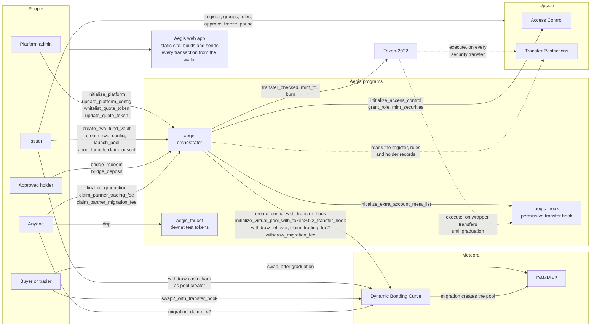
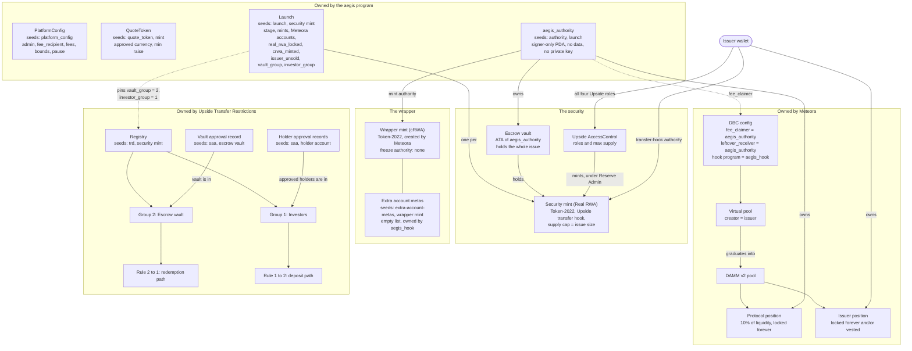
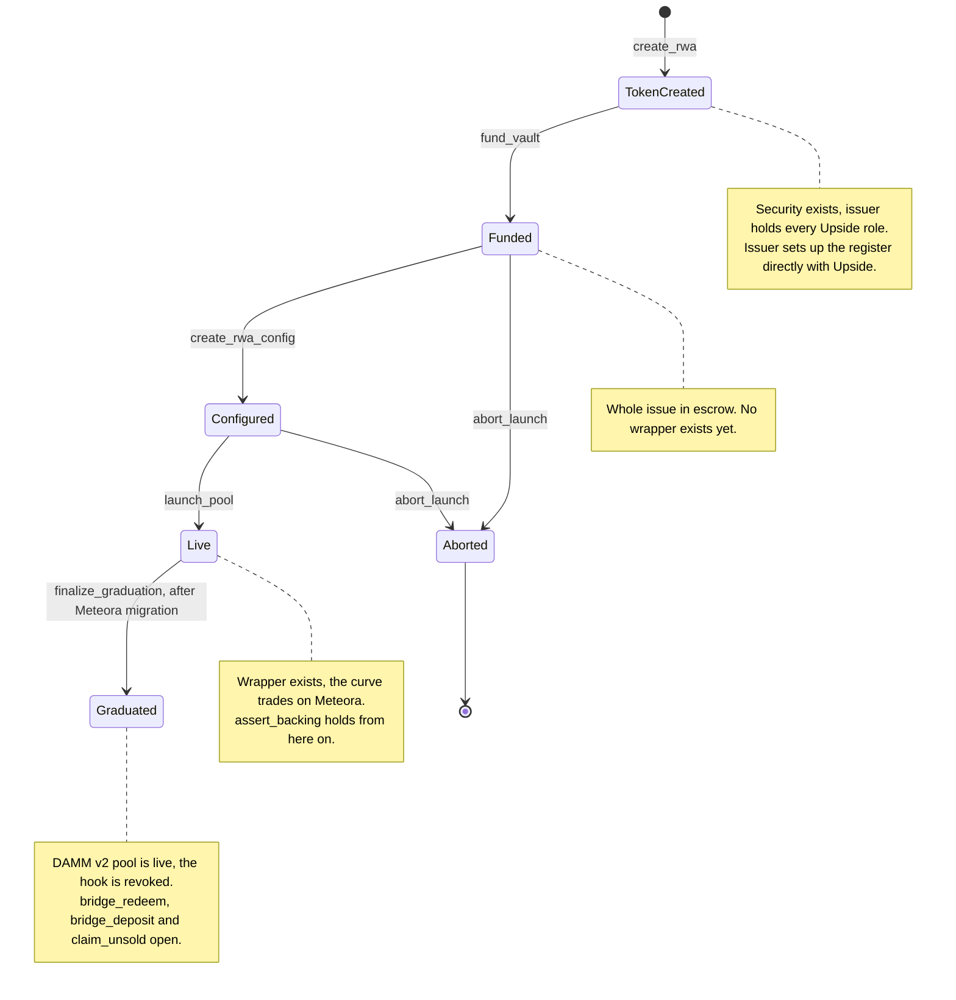
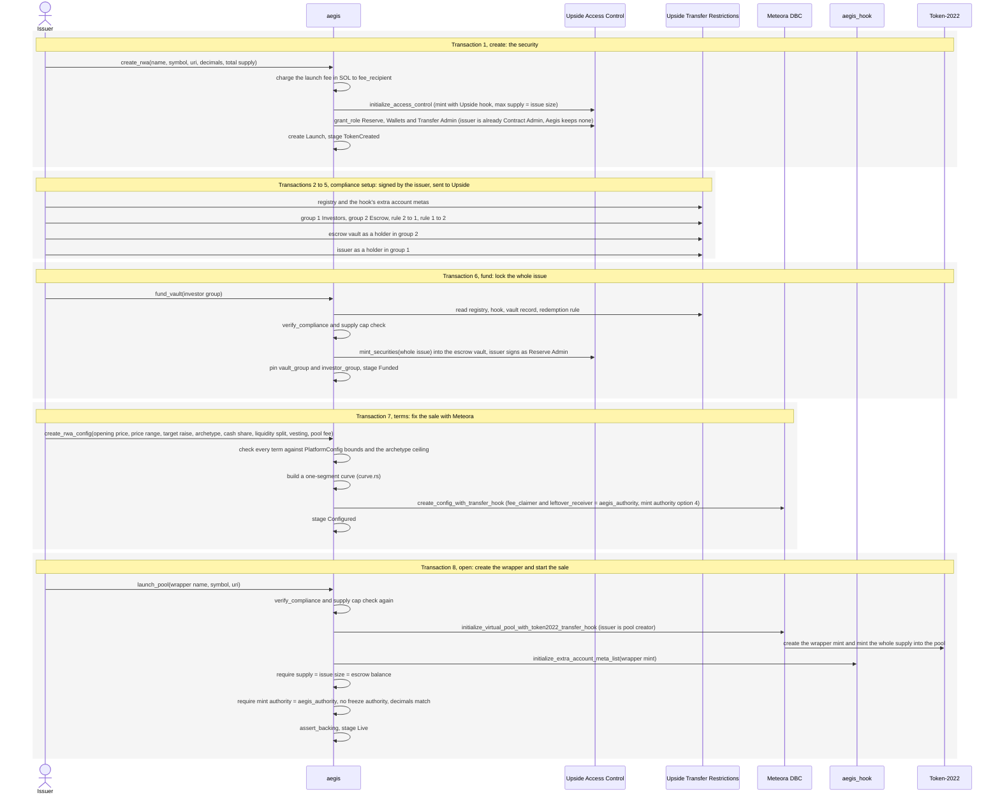
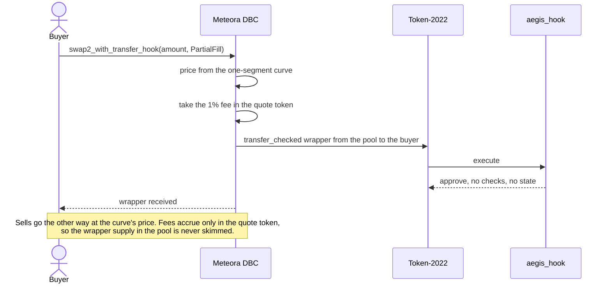
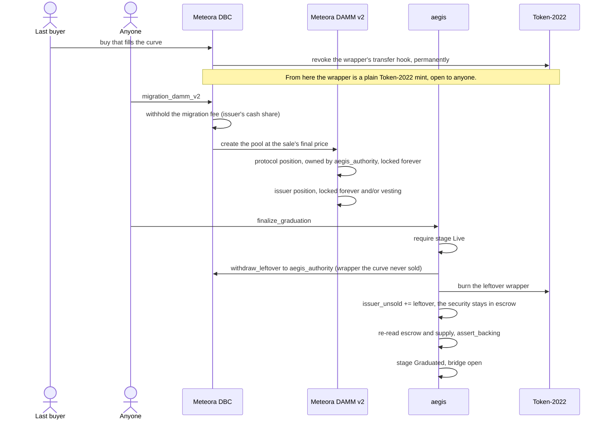
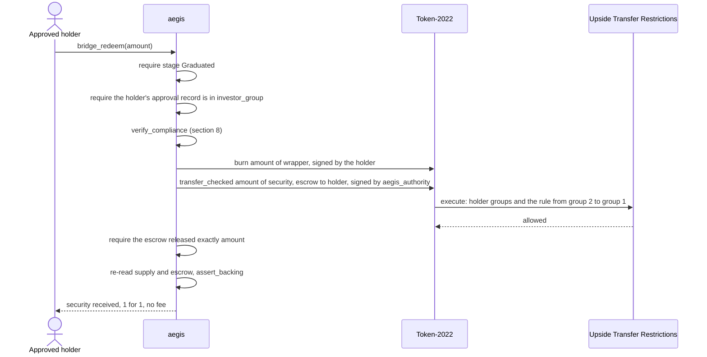
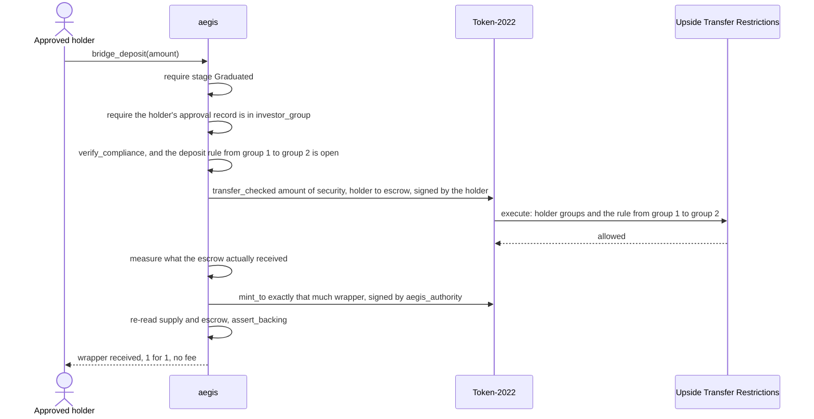
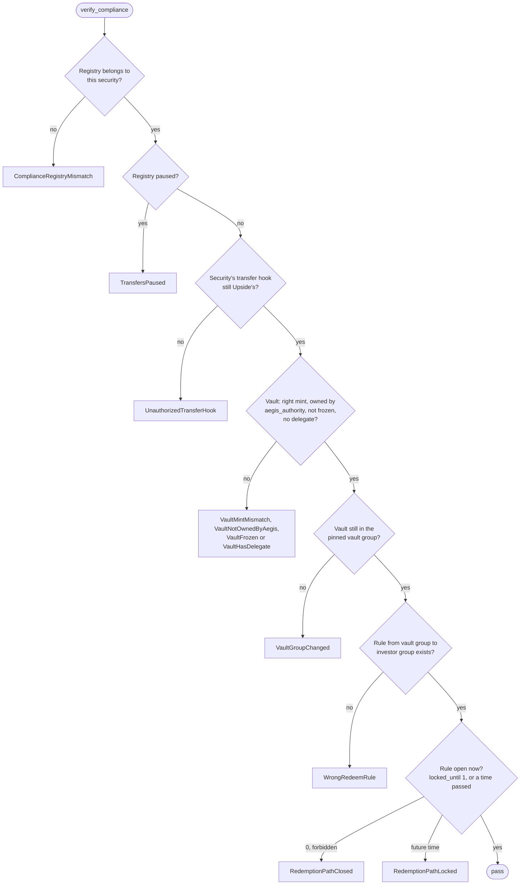
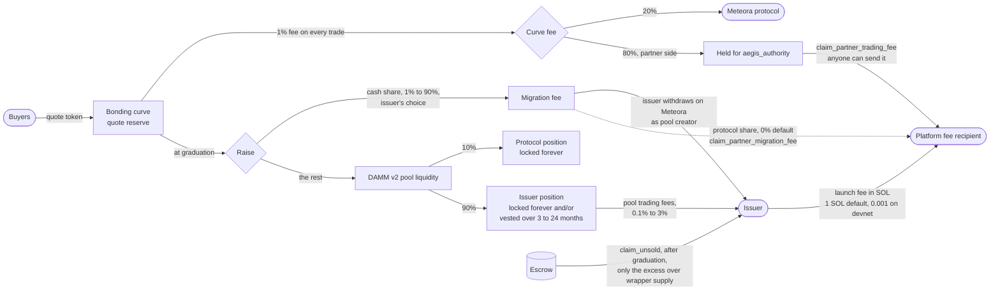

# Aegis architecture

Diagrams of how Aegis works, drawn from the program source. Every instruction, account, seed and cross-program call shown here exists in the code; file paths point to where it happens. For the overview, start with the [README](../README.md).

1. [System overview](#1-system-overview)
2. [Accounts and authorities](#2-accounts-and-authorities)
3. [Launch lifecycle](#3-launch-lifecycle)
4. [Launching an asset](#4-launching-an-asset)
5. [Trading during the sale](#5-trading-during-the-sale)
6. [Graduation](#6-graduation)
7. [The bridge](#7-the-bridge)
8. [The compliance gate](#8-the-compliance-gate)
9. [Where the money goes](#9-where-the-money-goes)
10. [Who controls what](#10-who-controls-what)

## 1. System overview

Every party, every program, and the instructions that connect them. Solid arrows are calls; dotted arrows are reads or calls made by the token program itself.

## 2. Accounts and authorities

What each account is, which program owns it, and who holds authority over it. One `Launch` and one `aegis_authority` exist per asset, so a launch can never touch another launch's escrow.

The group numbers are Aegis's convention (`GROUP_INVESTOR = 1`, `GROUP_VAULT = 2` in [`constants.rs`](../programs/aegis/src/constants.rs)). `fund_vault` reads the vault's group from its approval record and pins both numbers on the `Launch`, so a later change is detected.

## 3. Launch lifecycle

Stages only move forward. Every instruction requires the exact stage it is valid in ([`state/launch.rs`](../programs/aegis/src/state/launch.rs)).

`abort_launch` is only reachable before any wrapper exists. From `Live` on, buyers hold wrapper backed by the escrow, so the asset is no longer the issuer's alone to withdraw.

## 4. Launching an asset

The eight transactions an issuer sends, in order. Steps 2 to 5 are signed by the issuer directly against Upside; Aegis does not configure compliance for the issuer, it verifies it at step 6.

The app sends these as one wallet approval using durable nonces, but each is its own transaction and progress is read back from the chain, so a launch can resume after any step ([`app/src/chain/issue.ts`](../app/src/chain/issue.ts)).

## 5. Trading during the sale

The Aegis program is not in the trade path. Buyers call Meteora directly; Token-2022 invokes the permissive hook on each wrapper transfer.

Buys use `PartialFill`, so the buy that completes the sale is filled up to the target instead of failing. Because Aegis sizes the curve so total quote capacity matches the target, Meteora books no surplus and no surplus claim exists ([`curve.rs`](../programs/aegis/src/curve.rs)).

## 6. Graduation

Two permissionless transactions, sent by anyone once the curve is full. Neither moves any security, so no compliance setting can hold graduation back.

The unsold security stays in escrow instead of being sent to the issuer, so opening the bridge never depends on the issuer being a registered holder ([`finalize_graduation.rs`](../programs/aegis/src/instructions/finalize_graduation.rs)). The issuer collects it later with `claim_unsold`.

## 7. The bridge

Open after graduation to wallets in the launch's investor group. Redemption puts a floor under the wrapper's market price, and deposit puts a ceiling on it ([`bridge.rs`](../programs/aegis/src/instructions/bridge.rs)).

### Redeem: wrapper to security

### Deposit: security to wrapper

Burning first on redeem means that if the security cannot be released, the burn is undone with the rest of the transaction. On deposit the wrapper minted is what arrived, not what was asked for.

## 8. The compliance gate

`verify_compliance` reads Upside's live state every time acting on a broken setup would cost someone money. The issuer owns that state and can change it at any time, so it is checked at each gate rather than recorded once ([`compliance.rs`](../programs/aegis/src/compliance.rs)).

| Gate | `verify_compliance` | Supply cap unchanged | `assert_backing` |
|---|---|---|---|
| `fund_vault` | yes | yes | |
| `launch_pool` | yes | yes | yes |
| `bridge_redeem` | yes | | yes |
| `bridge_deposit` | yes, plus the deposit rule | | yes |
| `abort_launch` | yes | | yes |
| `claim_unsold` | yes | | yes |
| `finalize_graduation` | not needed, moves no security | | yes |

The supply cap check runs only where a new buyer is about to enter. Upside's cap can only be raised, so checking it on the bridge would let one lawful share issue block every holder's exit for good.

## 9. Where the money goes

Default settings from `initialize_platform`; the admin can change them for new launches, and the issuer chooses within the bounds.

The protocol's DAMM v2 position also earns pool trading fees. It is owned by `aegis_authority`, and the program does not yet have an instruction to claim them ([`claim.rs`](../programs/aegis/src/instructions/claim.rs)), so they accrue in the position.

## 10. Who controls what

| Power | Held by | Limits |
|---|---|---|
| Change fees, bounds, currencies; pause | Platform admin | Only reaches launches that have not opened their sale. No authority over any security, escrow or wrapper. |
| All four Upside roles: mint, approve, freeze, pause, force transfer, burn | Issuer | Securities law requires them. They reach the escrow too; if the escrow ever falls short, `assert_backing` stops the bridge and `claim_unsold` absorbs the loss first. |
| Point the security's transfer hook elsewhere | Issuer, as hook authority | Detected by `verify_compliance` at every gate. |
| Mint wrapper | `aegis_authority`, only in `bridge_deposit` | Exactly what the escrow received. |
| Move security out of the escrow | `aegis_authority` | Only in `bridge_redeem`, `abort_launch` and `claim_unsold`, each through the compliance gate. |
| Freeze the wrapper | Nobody | `launch_pool` requires the freeze authority to be empty. |
| Withdraw graduated liquidity on day one | Nobody | Protocol share locked forever; issuer share locked or vested. |
